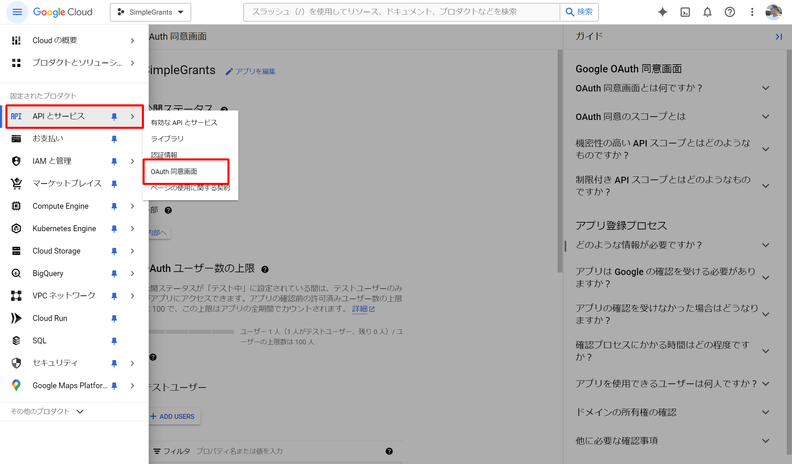
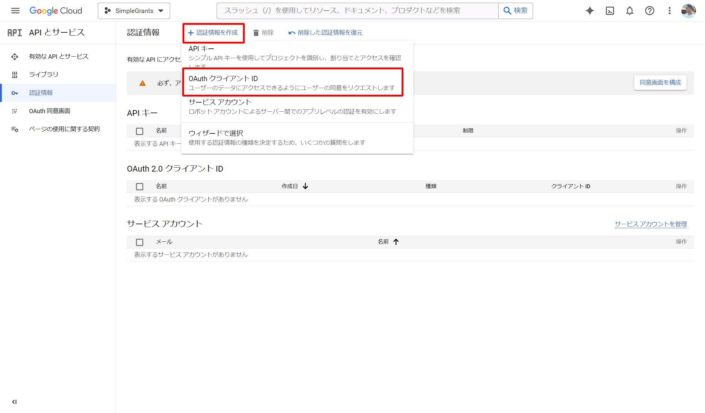

# Google ログインの設定方法

Simplegrants は Google アカウントの SSO が実装されています。開発環境並びに、本番環境の設定は以下に従ってください。

## 1. GCP アカウントの作成と、プロジェクトの作成

[Google Could Platform](https://console.cloud.google.com/)にアクセスし、アカウントとプロジェクトを作成してください。

## 2. 同意画面の設定

OAuth 同意画面を作成します。テスト環境では特定のメールアドレスでのみログインできるようになっているので注意してください。

## 3. OAuth クライアント ID の作成

OAuth クライアント ID 作成画面から ID とシークレットを作成します。

## 4. 環境変数の設定

`/frontend/.env` の `GOOGLE_CLIENT_ID`、`GOOGLE_CLIENT_SECRET`にステップ 3 で作成した ID とシークレットを設定します。
